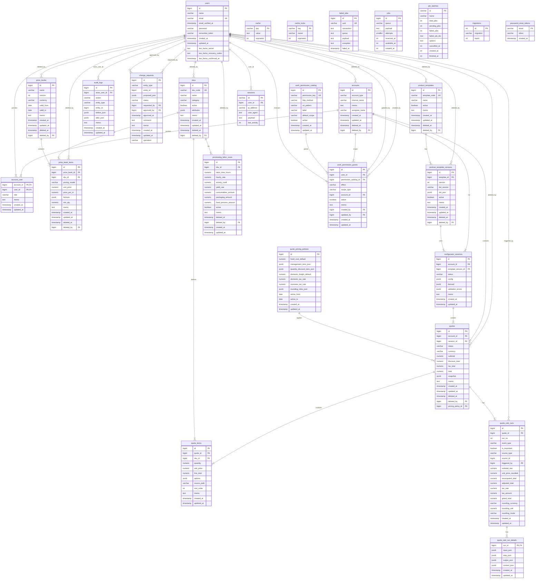

```mermaid
erDiagram
    users {
        bigint id PK
        varchar name
        varchar email UK
        timestamp email_verified_at
        varchar password
        varchar remember_token
        timestamp created_at
        timestamp updated_at
        text two_factor_secret
        text two_factor_recovery_codes
        timestamp two_factor_confirmed_at
    }

    accounts {
        bigint id PK
        varchar account_type
        varchar internal_name
        text memo
        varchar assignee_name
        timestamp created_at
        timestamp updated_at
        timestamp deleted_at
        bigint deleted_by FK
    }

    account_user {
        bigint account_id PK, FK
        bigint user_id PK, FK
        varchar role
        text memo
        timestamp created_at
        timestamp updated_at
    }

    quotes {
        bigint id PK
        bigint account_id FK
        bigint session_id FK
        varchar status
        varchar currency
        numeric subtotal
        numeric discount_total
        numeric tax_total
        numeric total
        jsonb snapshot
        text memo
        timestamp created_at
        timestamp updated_at
        timestamp deleted_at
        bigint deleted_by FK
        bigint pricing_policy_id FK
    }

    quote_items {
        bigint id PK
        bigint quote_id FK
        bigint sku_id FK
        numeric quantity
        numeric unit_price
        numeric line_total
        jsonb options
        varchar source_path
        int sort_order
        text memo
        timestamp created_at
        timestamp updated_at
    }

    skus {
        bigint id PK
        varchar sku_code UK
        varchar name
        varchar category
        boolean active
        jsonb attributes
        text memo
        timestamp created_at
        timestamp updated_at
        timestamp deleted_at
        bigint deleted_by FK
    }

    product_templates {
        bigint id PK
        varchar template_code UK
        varchar name
        boolean active
        text memo
        timestamp created_at
        timestamp updated_at
        timestamp deleted_at
        bigint deleted_by FK
    }

    configurator_sessions {
        bigint id PK
        bigint account_id FK
        bigint template_version_id FK
        varchar status
        jsonb config
        jsonb derived
        jsonb validation_errors
        text memo
        timestamp created_at
        timestamp updated_at
    }

    audit_logs {
        bigint id PK
        bigint actor_user_id FK
        varchar action
        varchar entity_type
        bigint entity_id
        jsonb before_json
        jsonb after_json
        text memo
        timestamp created_at
        timestamp updated_at
    }

    change_requests {
        bigint id PK
        varchar entity_type
        bigint entity_id
        jsonb proposed_json
        varchar status
        bigint requested_by FK
        bigint approved_by FK
        timestamp approved_at
        text comment
        text memo
        timestamp created_at
        timestamp updated_at
        varchar operation
    }

    price_book_items {
        bigint id PK
        bigint price_book_id FK
        bigint sku_id FK
        varchar pricing_model
        numeric unit_price
        numeric price_per_m
        jsonb formula
        numeric min_qty
        text memo
        timestamp created_at
        timestamp updated_at
        timestamp deleted_at
        bigint deleted_by FK
    }

    price_books {
        bigint id PK
        varchar name
        int version
        varchar currency
        date valid_from
        date valid_to
        text memo
        timestamp created_at
        timestamp updated_at
        timestamp deleted_at
        bigint deleted_by FK
    }

    product_template_versions {
        bigint id PK
        bigint template_id FK
        int version
        varchar dsl_version
        jsonb dsl_json
        boolean active
        text memo
        timestamp created_at
        timestamp updated_at
        timestamp deleted_at
        bigint deleted_by FK
    }

    processing_labor_costs {
        bigint id PK
        bigint sku_id FK
        numeric labor_time_hours
        numeric hourly_rate
        numeric activity_coeff
        numeric yield_rate
        numeric consumables_amount
        numeric packaging_amount
        numeric fixed_process_amount
        boolean active
        text memo
        timestamp deleted_at
        bigint deleted_by FK
        timestamp created_at
        timestamp updated_at
    }

    quote_calc_run_details {
        bigint run_id PK, FK
        jsonb input_json
        jsonb step_json
        jsonb output_json
        jsonb context_json
        timestamp created_at
        timestamp updated_at
    }

    quote_calc_runs {
        bigint id PK
        bigint quote_id FK
        int run_no
        varchar event_type
        boolean is_important
        varchar source_type
        bigint source_id
        bigint triggered_by FK
        numeric subtotal_raw
        numeric unit_price_rounded
        numeric recomputed_total
        numeric adjusted_total
        numeric tax_rate
        numeric tax_amount
        numeric grand_total
        varchar rounding_currency
        numeric rounding_unit
        varchar rounding_mode
        timestamp created_at
        timestamp updated_at
    }

    quote_pricing_policies {
        bigint id PK
        numeric fixed_cost_default
        jsonb management_tiers_json
        jsonb quantity_discount_tiers_json
        numeric domestic_freight_default
        numeric domestic_tax_rate
        numeric overseas_tax_rate
        jsonb rounding_rules_json
        date active_from
        date active_to
        timestamp created_at
        timestamp updated_at
    }

    work_permission_catalog {
        bigint id PK
        varchar permission_key UK
        varchar http_method
        varchar uri_pattern
        varchar label
        varchar default_scope
        boolean active
        timestamp created_at
        timestamp updated_at
    }

    work_permission_grants {
        bigint id PK
        bigint user_id FK
        bigint permission_catalog_id FK
        varchar effect
        varchar scope_type
        bigint account_id FK
        boolean active
        text memo
        bigint created_by FK
        bigint updated_by FK
        timestamp created_at
        timestamp updated_at
    }

    sessions {
        varchar id PK
        bigint user_id FK
        varchar ip_address
        text user_agent
        text payload
        int last_activity
    }
    
    cache {
        varchar key PK
        text value
        int expiration
    }

    cache_locks {
        varchar key PK
        varchar owner
        int expiration
    }

    failed_jobs {
        bigint id PK
        varchar uuid UK
        text connection
        text queue
        text payload
        text exception
        timestamp failed_at
    }

    jobs {
        bigint id PK
        varchar queue
        text payload
        smallint attempts
        int reserved_at
        int available_at
        int created_at
    }

    job_batches {
        varchar id PK
        varchar name
        int total_jobs
        int pending_jobs
        int failed_jobs
        text failed_job_ids
        text options
        int cancelled_at
        int created_at
        int finished_at
    }

    migrations {
        int id PK
        varchar migration
        int batch
    }

    password_reset_tokens {
        varchar email PK
        varchar token
        timestamp created_at
    }

    users ||--o{ accounts : "deleted_by"
    users ||--o{ quotes : "deleted_by"
    users ||--o{ skus : "deleted_by"
    users ||--o{ product_templates : "deleted_by"
    users ||--o{ price_books : "deleted_by"
    users ||--o{ price_book_items : "deleted_by"
    users ||--o{ product_template_versions : "deleted_by"
    users ||--o{ processing_labor_costs : "deleted_by"
    users ||--o{ audit_logs : "actor_user_id"
    users ||--o{ change_requests : "requested_by"
    users ||--o{ change_requests : "approved_by"
    users ||--o{ quote_calc_runs : "triggered_by"
    users ||--o{ work_permission_grants : "created_by"
    users ||--o{ work_permission_grants : "updated_by"
    users ||--o{ sessions : "user_id"

    accounts ||--|{ account_user : "junction"
    users ||--|{ account_user : "junction"

    accounts ||--|{ quotes : "contains"
    accounts ||--|{ configurator_sessions : "for"
    accounts ||--|{ work_permission_grants : "scope"

    configurator_sessions ||--|{ quotes : "creates"
    product_template_versions ||--|{ configurator_sessions : "uses"

    product_templates ||--|{ product_template_versions : "has"

    quotes ||--|{ quote_items : "contains"
    quotes ||--|{ quote_calc_runs : "has"
    quote_pricing_policies ||--o{ quotes : "applies"
    
    skus ||--|{ quote_items : "defines"
    skus ||--|{ price_book_items : "defines"
    skus ||--|{ processing_labor_costs : "for"

    price_books ||--|{ price_book_items : "contains"
    
    quote_calc_runs ||--|{ quote_calc_run_details : "has"
    
    work_permission_catalog ||--|{ work_permission_grants : "grants"
    users ||--|{ work_permission_grants : "receives"
```