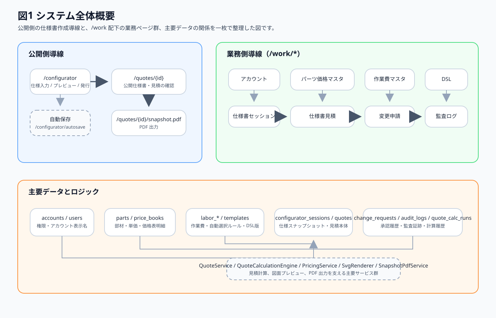
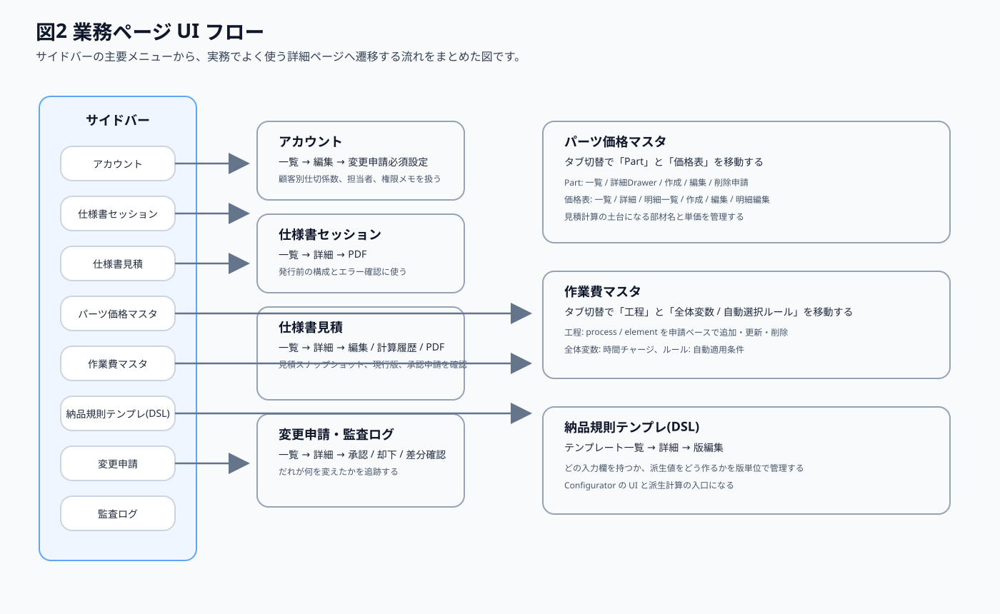
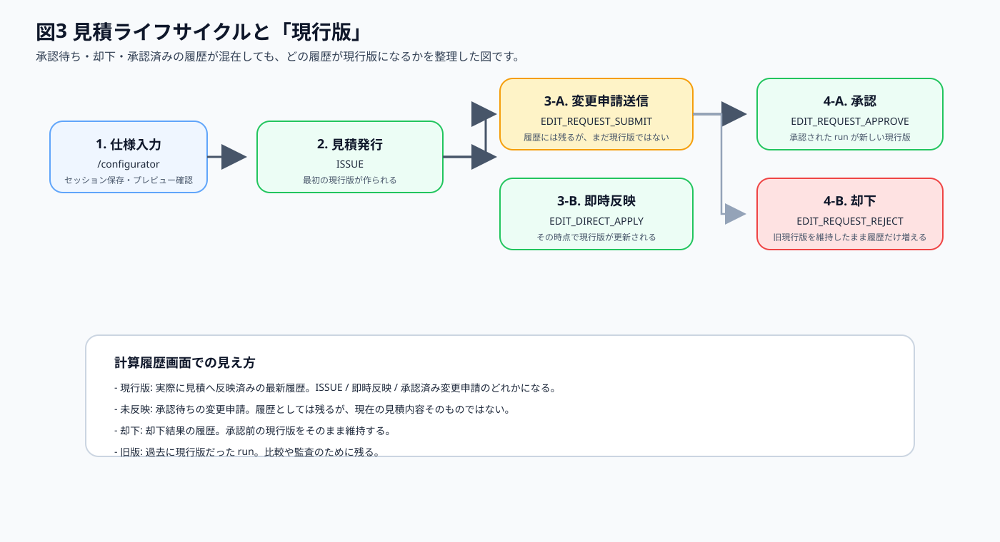
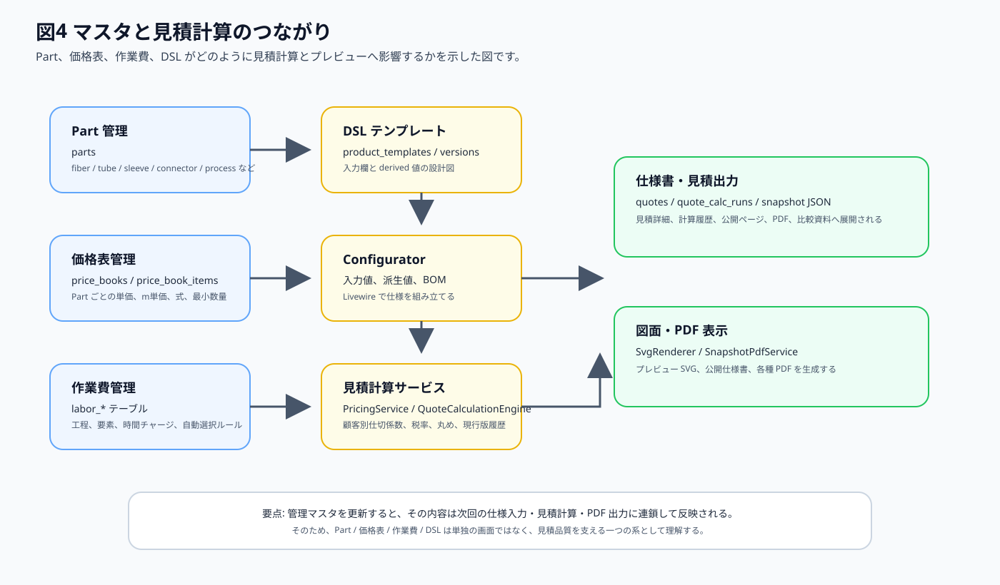
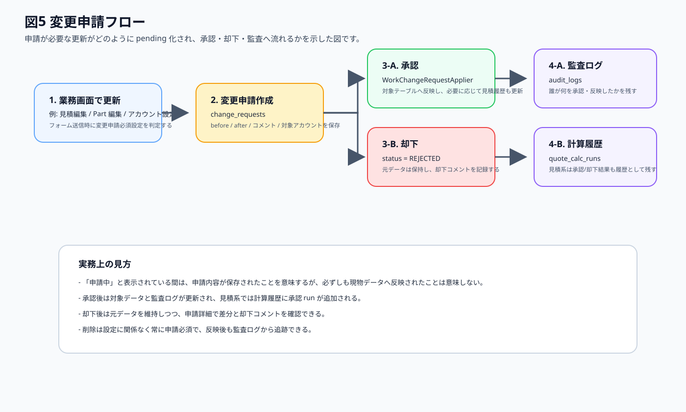
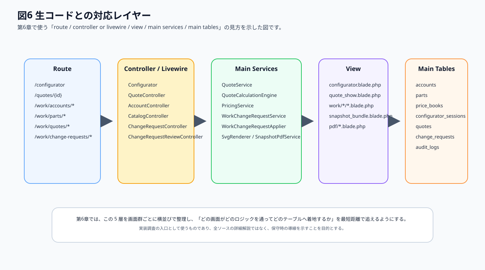

# Deltafiber受注販管システム Webアプリ説明書

---

## 文書情報

| 項目 | 内容 |
| --- | --- |
| 文書名 | Deltafiber受注販管システム Webアプリ説明書 |
| 版数 | 第1版 |
| 作成日 | 2026-03-25 |
| 想定読者 | 運用担当者、営業担当者、承認担当者、保守担当者 |
| 対象範囲 | 公開側 `/configurator` と `/quotes/*`、業務側 `/work/*`、ユーザー設定 |
| 利用前提 | ログイン済みであること。業務ページは `admin` または `sales` 相当の権限を前提とする |
| Word 対応 | `17_Webアプリ説明書_Word用.html` を Microsoft Word で直接開ける版として同梱する |
| 図版について | 図版は SVG で同梱している。Word 版を開くときも `assets/web_app_manual/` を同じ相対配置で維持すること |

## 本書の読み方

本書は、日常運用で迷わず操作するための実務マニュアルとして作成しています。  
前半は「何の画面で何をするか」を理解するための利用者向け説明、後半は「どのコードとどのテーブルに対応するか」を追うための保守向け説明です。  
まずは第1章と第2章で全体像を把握し、日常操作は第3章と第4章、トラブル時は第5章、コード調査時は第6章を参照してください。

## 目次

- [1. 全体概要](#1-全体概要)
- [2. 業務ページUIフロー](#2-業務ページuiフロー)
- [3. 各ページの使い方](#3-各ページの使い方)
- [4. やりたいこと別の使い方](#4-やりたいこと別の使い方)
- [5. 困ったときは](#5-困ったときは)
- [6. 生コードとの対応](#6-生コードとの対応)

---

## 1. 全体概要

本システムは、光ファイバ構成の仕様入力から、仕様書・見積・変更申請・監査までを一つの流れで扱う Web アプリです。  
利用者の視点では「公開側で仕様を作る流れ」と「業務側でマスタ、見積、承認、監査を回す流れ」に分かれます。  
まずは、どの画面がどの役割を担っているかを俯瞰してください。

### 1.1 システムの役割

| 区分 | 主な URL | 主な役割 |
| --- | --- | --- |
| 公開側 | `/configurator` | ファイバ、チューブ、コネクタなどを選び、仕様書を発行する |
| 公開側 | `/quotes/{id}` | 発行済み仕様書・見積を確認する |
| 公開側 | `/quotes/{id}/snapshot.pdf` | 発行済み仕様書・見積を PDF で出力する |
| 業務側 | `/work/accounts/*` | アカウント、担当者、顧客別仕切係数、変更申請必須設定を管理する |
| 業務側 | `/work/parts/*`, `/work/price-books/*` | Part と価格表を管理する |
| 業務側 | `/work/labor-costs/*` | 作業費、工程、ルールを管理する |
| 業務側 | `/work/templates/*` | DSL テンプレートと版を管理する |
| 業務側 | `/work/sessions/*` | 発行前の仕様セッションを確認する |
| 業務側 | `/work/quotes/*` | 発行後の見積、計算履歴、変更申請を扱う |
| 業務側 | `/work/change-requests/*` | 変更申請の承認・却下・差分確認を行う |
| 業務側 | `/work/audit-logs/*` | 監査証跡を追う |

### 1.2 利用者ごとの見え方

| 利用者 | 主に使う画面 | 主な目的 |
| --- | --- | --- |
| 顧客・営業の公開利用者 | `/configurator`, `/quotes/{id}` | 仕様入力、見積確認、PDF 取得 |
| 営業・運用担当者 | `/work/quotes/*`, `/work/sessions/*`, `/work/accounts/*` | 見積確認、顧客条件設定、申請状況確認 |
| マスタ管理担当者 | `/work/parts/*`, `/work/price-books/*`, `/work/labor-costs/*`, `/work/templates/*` | 見積根拠となるマスタ更新 |
| 承認担当者 | `/work/change-requests/*` | 変更申請の承認・却下 |
| 保守担当者 | 第6章の対応表 | route、controller、service、table の対応確認 |

### 1.3 全体図

図1では、公開側の仕様入力と、業務側の各メニュー、さらに見積計算を支える主要テーブルとサービスの関係を示しています。  
実務では「見積だけを見る」「価格表だけを更新する」と感じやすいですが、実際には各画面はひと続きの流れでつながっています。

### 1.4 権限と公開範囲

1. `/configurator` は仕様入力の入口です。
2. `/quotes/{id}` と `/quotes/{id}/snapshot.pdf` は、ログイン済みかつ当該アカウントに紐づく利用者だけが参照できます。
3. `/work/*` 配下は、業務権限を持つ利用者向けです。サイドバーもこの権限に応じて表示されます。
4. 変更申請必須設定により、作成・更新が即時反映か承認必須かが変わります。
5. 削除は設定に関係なく常に変更申請必須です。

### 1.5 主要データの流れ

| データ | どこで作るか | どこで使うか |
| --- | --- | --- |
| `config` | `/configurator` | プレビュー、セッション、見積スナップショット |
| `derived` | DSL と Configurator | SVG 表示、仕様書表示、PDF |
| Part | Parts 画面 | Configurator の選択肢、価格表、BOM、見積明細 |
| 価格表 | 価格表画面 | 見積計算の単価決定 |
| 作業費ルール | 作業費管理 | QuoteCalculationEngine の作業費計算 |
| 顧客別仕切係数 | アカウント画面 | 当該アカウントの見積既定値 |
| 変更申請 | 各編集画面 | 承認・却下、見積履歴、監査ログ |
| 計算履歴 | 見積更新時 | 現行版判定、見積比較、承認結果の追跡 |

### 1.6 実務上の前提

**注意**  
本システムは「仕様書入力アプリ」ではなく、「見積根拠の再現性を保つための運用システム」です。  
そのため、Part、価格表、作業費、DSL のいずれかを変えると、次回の仕様入力や見積結果にも影響します。

---

## 2. 業務ページUIフロー

業務ページは、左サイドバーのメニューから横断的に使います。  
日常運用では、一覧から詳細へ入り、必要に応じて編集画面や変更申請へ進む流れが基本です。

### 2.1 サイドバー全体フロー

### 2.2 メニュー別の入口と主な遷移

| メニュー | 入口 | よく使う次画面 | 主な用途 |
| --- | --- | --- | --- |
| アカウント | `/work/accounts` | 編集、変更申請必須設定 | 顧客条件、担当者、顧客別仕切係数の調整 |
| 仕様書セッション | `/work/sessions` | 詳細、PDF | 発行前の内容とエラー確認 |
| 仕様書見積 | `/work/quotes` | 詳細、編集、計算履歴、PDF | 発行済み見積の確認と申請 |
| パーツ価格マスタ | `/work/parts`, `/work/price-books` | Part 編集、価格表詳細、明細編集 | 見積根拠となる部材と単価の管理 |
| 作業費マスタ | `/work/labor-costs` | 工程更新、ルール更新 | 作業費計算ロジックの調整 |
| 納品規則テンプレ(DSL) | `/work/templates` | 詳細、版編集 | 入力 UI と派生値の設計 |
| 変更申請 | `/work/change-requests` | 詳細、承認、却下 | 反映前の差分確認と承認判断 |
| 監査ログ | `/work/audit-logs` | 詳細 | 実際に反映された変更の追跡 |

### 2.3 実務でよくある横断フロー

1. 顧客条件を変えたいときは、`アカウント` から入り、必要に応じて `変更申請` を通します。
2. 見積根拠を直したいときは、`パーツ価格マスタ`、`作業費マスタ`、`納品規則テンプレ(DSL)` を先に整えます。
3. 発行済み見積の追跡は、`仕様書見積` から入り、必要に応じて `変更申請` と `監査ログ` へ進みます。
4. 発行前の入力内容を確認したいときは `仕様書セッション` を見ます。

### 2.4 見積の現行版を理解する

**補足**  
見積の計算履歴では、承認待ちや却下の履歴も残ります。  
ただし、実際に見積へ反映済みの最新履歴だけが「現行版」です。  
日常運用では、見積詳細や計算履歴を確認する際に、この現行版の見方を押さえておくことが重要です。

---

## 3. 各ページの使い方

本章では、ページファミリ単位で「目的」「誰が使うか」「見どころ」「操作手順」を整理します。  
画面単位ではなく、利用者が理解しやすいまとまりで記載しています。

### 3.1 コンフィギュレーター（公開側）

**ページの目的**  
ファイバ構成を入力し、仕様書・見積を発行するための起点画面です。

**誰が使うか**  
顧客、営業担当者、公開導線の利用者。

**画面の見どころ**  
- 左ペインで加工種別、ファイバ、チューブ、コネクタ、注文数量、メモを入力します。  
- 右側ではプレビュー、保存状態、仕様書発行ボタンを確認できます。  
- 見積編集モードでは、仕様書番号や編集コメントも扱います。

**操作手順**  
1. 加工種別を選びます。MFD 系と TEC 系では入力項目が変わります。  
2. ファイバとチューブの種類、長さ、位置関係を入力します。  
3. コネクタ、注文数量、メモを入力します。  
4. エラー表示がないことを確認し、「仕様書発行」を押します。  
5. 発行後は公開仕様書ページへ移動して内容を確認します。

**注意点**  
- 保存状態に「未保存」「保存済み」「保存失敗」が表示されます。  
- エラーが残っている間は仕様書発行できません。  
- 見積編集モードでは、その場で即時反映される場合と、変更申請になる場合があります。

**関連ページ**  
公開仕様書、仕様書セッション、仕様書見積、変更申請。

**生コード対応**  
入口は `Configurator` Livewire です。詳細な対応は [6.1 公開導線](#61-公開導線) を参照してください。

### 3.2 公開仕様書・公開 PDF

**ページの目的**  
発行済みの仕様書・見積を確認し、必要に応じて PDF を取得するための画面です。

**誰が使うか**  
顧客、営業担当者、公開導線の利用者。

**画面の見どころ**  
- 仕様書概要、アカウント情報、SVG プレビューを確認できます。  
- 詳細セクションでは構成表を確認できます。  
- PDF ボタンから同内容の PDF を取得できます。

**操作手順**  
1. 発行後に `/quotes/{id}` を開きます。  
2. 仕様構成、担当者、メールアドレス、メモを確認します。  
3. 必要に応じて `Download PDF` を押します。  
4. 印刷配布が必要な場合は PDF を保存します。

**注意点**  
- 自分のアカウントに紐づかない見積は表示できません。  
- ここで見える内容は、その時点の見積スナップショットです。  
- 画面文言は英語表示です。

**関連ページ**  
コンフィギュレーター、仕様書見積詳細、見積 PDF。

**生コード対応**  
公開仕様書は route クロージャ、`SvgRenderer`、`SnapshotPdfService` を通じて表示されます。詳細は [6.1 公開導線](#61-公開導線) を参照してください。

### 3.3 アカウント

**ページの目的**  
アカウント表示名、担当者、顧客別仕切係数、変更申請必須設定を管理するページ群です。

**誰が使うか**  
営業担当者、運用担当者、管理者。

**画面の見どころ**  
- 一覧でアカウント表示名、ユーザー登録名、担当者、申請必須設定の要約を見られます。  
- 編集画面で顧客別仕切係数を設定できます。  
- 変更申請必須設定画面で、どの対象を即時反映にするか切り替えられます。

**操作手順**  
1. 一覧で対象アカウントを検索します。  
2. 編集画面で担当者やメモ、顧客別仕切係数を更新します。  
3. 必要に応じて「このアカウントの変更申請必須設定ページへ」から申請設定を開きます。  
4. 更新内容が即時反映か申請送信かを、ステータス文言で確認します。

**注意点**  
- 顧客別仕切係数は、当該アカウントの見積既定値として使われます。  
- 削除は設定に関係なく常に申請必須です。  
- 設定ページ自体の更新も、変更申請対象にできます。

**関連ページ**  
仕様書見積、変更申請、監査ログ。

**生コード対応**  
`AccountController` と `AccountChangeRequestRequirementService` が中心です。詳細は [6.2 アカウント](#62-アカウント) を参照してください。

### 3.4 パーツ価格マスタ

**ページの目的**  
見積計算の基礎になる Part と価格表を管理するページ群です。

**誰が使うか**  
マスタ管理担当者、営業管理担当者、保守担当者。

**画面の見どころ**  
- 1 つの入口から「Part」と「価格表」をタブ切替できます。  
- Part 側は一覧、詳細 Drawer、作成、編集、削除申請が中心です。  
- 価格表側は一覧、詳細、明細一覧、作成、編集、明細編集が中心です。

**操作手順**  
1. `パーツ価格マスタ` を開き、対象タブを選びます。  
2. Part を更新するときは、カテゴリや有効状態、名称、メモを確認します。  
3. 単価を更新するときは価格表詳細から明細を確認し、必要な明細を編集します。  
4. 更新後は、必要に応じて見積画面で結果が変わっているか確認します。

**注意点**  
- Part 名と価格表明細は、見積結果に直結します。  
- 申請中の Part や価格表は一覧に「申請中」と表示されます。  
- 価格表の明細は、Part、価格モデル、単価、式、最小数量の整合が重要です。

**関連ページ**  
作業費マスタ、DSL テンプレート、仕様書見積。

**生コード対応**  
`CatalogController`、`SkuController`、`PriceBookController`、`PriceBookItemController` が中心です。詳細は [6.3 パーツ価格マスタ](#63-パーツ価格マスタ) を参照してください。

### 3.5 作業費マスタ

**ページの目的**  
見積の作業費計算で使う工程、要素、全体変数、自動選択ルールを管理するページです。

**誰が使うか**  
原価管理担当者、技術担当者、保守担当者。

**画面の見どころ**  
- 「工程」タブでは process と element を階層で扱います。  
- 「全体変数 / 自動選択ルール」タブでは時間チャージとルール条件を編集します。  
- 入力はその場編集に近いレイアウトですが、反映は変更申請ベースです。

**操作手順**  
1. 作業費管理を開き、工程タブか設定タブを選びます。  
2. 工程を追加・更新するときは、コード、名称、良品率、並び順、有効状態を確認します。  
3. ルールを更新するときは、対象工程、タグ、必要カテゴリ、必要コードを整理します。  
4. 見積結果への影響確認が必要な場合は、見積画面で再計算結果を確認します。

**注意点**  
- 作業費マスタは見積計算ロジックの根幹です。変更前に意図を明確にしてください。  
- ルール条件を広くしすぎると、意図しない工程が見積へ自動適用されます。  
- 調整後は、見積の計算内訳で反映結果を確認するのが安全です。

**関連ページ**  
パーツ価格マスタ、仕様書見積、監査ログ。

**生コード対応**  
`LaborCostController`、`LaborCostEngine`、`QuoteCalculationEngine` が主経路です。詳細は [6.4 作業費管理](#64-作業費管理) を参照してください。

### 3.6 納品規則テンプレ(DSL)

**ページの目的**  
Configurator が持つ入力欄、派生値、版の切替を管理するページ群です。

**誰が使うか**  
保守担当者、開発者、テンプレート管理担当者。

**画面の見どころ**  
- 一覧でテンプレートの有効状態を確認できます。  
- 詳細画面で版一覧を確認し、各版を編集できます。  
- 版単位で DSL JSON を持つため、既存版を保ちつつ新しい版を追加できます。

**操作手順**  
1. テンプレート一覧から対象テンプレートを開きます。  
2. 詳細画面で版一覧を確認します。  
3. 新版追加または既存版編集の申請を行います。  
4. 必要に応じて Configurator で入力 UI が想定どおりか確認します。

**注意点**  
- DSL の変更は UI と derived 値の両方へ影響します。  
- 既存見積との整合を保つため、運用上は版追加中心で扱うのが安全です。  
- 版を切り替えた後は、セッション・見積画面の表示も確認してください。

**関連ページ**  
コンフィギュレーター、仕様書セッション、仕様書見積。

**生コード対応**  
`TemplateController`、`TemplateVersionController`、`DslEngine` が中心です。詳細は [6.5 DSL テンプレート](#65-dsl-テンプレート) を参照してください。

### 3.7 仕様書セッション

**ページの目的**  
発行前の構成やエラー状態を確認するための管理画面です。

**誰が使うか**  
営業担当者、運用担当者。

**画面の見どころ**  
- 一覧でアカウント、担当者、DSL 版、ステータスを見られます。  
- 詳細では、発行前のスナップショットと PDF を確認できます。  
- 発行済み見積ではなく、発行前の状態を追う点が見積画面と異なります。

**操作手順**  
1. 一覧で対象セッションを検索します。  
2. 詳細画面で SVG、構成、メモ、エラー件数を確認します。  
3. 必要に応じて PDF を出力して共有します。  
4. 発行後の結果は仕様書見積側で追います。

**注意点**  
- セッションは見積本体ではありません。  
- 発行後の見積変更結果はここではなく、見積詳細で確認してください。  
- 発行前エラーの確認先として使うと混乱が少なくなります。

**関連ページ**  
コンフィギュレーター、仕様書見積。

**生コード対応**  
`SessionController`、`SvgRenderer`、`SnapshotPdfService` が主経路です。詳細は [6.6 仕様書セッション](#66-仕様書セッション) を参照してください。

### 3.8 仕様書見積

**ページの目的**  
発行済み見積の内容、計算履歴、変更申請、PDF を扱う中核ページ群です。

**誰が使うか**  
営業担当者、運用担当者、承認担当者、保守担当者。

**画面の見どころ**  
- 一覧では、アカウント、仕様書番号、合計、申請中状態を確認できます。  
- 詳細では、見積スナップショット、承認変更申請一覧、計算履歴 Drawer、計算内訳を確認できます。  
- 計算履歴では「現行版」「未反映」「却下」「旧版」を見分けられます。

**操作手順**  
1. 一覧から対象見積を開きます。  
2. 詳細画面でスナップショット、担当者、承認申請一覧を確認します。  
3. 必要に応じて編集画面または編集申請画面へ進みます。  
4. 計算履歴で現行版と承認待ち履歴を見分けます。  
5. PDF が必要な場合はスナップショットから出力します。

**注意点**  
- 「現行版」は、実際に見積へ反映済みの最新 run です。  
- 承認待ちの変更申請は履歴に残りますが、現行版ではありません。  
- メモ更新も変更申請必須になる場合があります。

**関連ページ**  
コンフィギュレーター、変更申請、監査ログ。

**生コード対応**  
`QuoteController`、`QuoteService`、`QuoteCalculationEngine`、`QuoteCalcRunRecorder`、`QuoteCalcHistoryService` が中心です。詳細は [6.7 仕様書見積](#67-仕様書見積) を参照してください。

### 3.9 変更申請

**ページの目的**  
反映前の変更内容を確認し、承認・却下を行うページ群です。

**誰が使うか**  
承認担当者、営業責任者、運用担当者。

**画面の見どころ**  
- 一覧でステータス、操作種別、対象種別、申請者、承認者を確認できます。  
- 詳細で差分、スナップショット比較、計算履歴、コメント、承認ボタンを確認できます。  
- 見積系の変更申請では、比較 PDF や計算履歴も確認できます。

**操作手順**  
1. 一覧で対象の申請を検索します。  
2. 詳細を開き、差分、コメント、比較資料を確認します。  
3. 問題なければ承認、差し戻す場合は却下コメント付きで却下します。  
4. 承認後は、対象画面側と監査ログ側で反映を確認します。

**注意点**  
- 削除申請は背景色と DELETE ピルで強調されます。  
- 見積系では承認・却下後に計算履歴が追加されます。  
- 却下後も申請差分は履歴として残ります。

**関連ページ**  
仕様書見積、アカウント、監査ログ。

**生コード対応**  
`ChangeRequestController`、`ChangeRequestReviewController`、`WorkChangeRequestService`、`WorkChangeRequestApplier` が主経路です。詳細は [6.8 変更申請](#68-変更申請) を参照してください。

### 3.10 監査ログ

**ページの目的**  
反映済みの変更を、あとから追跡・説明するためのページです。

**誰が使うか**  
運用担当者、承認担当者、保守担当者。

**画面の見どころ**  
- 一覧で実行者、アクション、対象種別、対象 ID、作成日を確認できます。  
- 詳細では before / after の差分をパス単位で見られます。  
- 変更申請と違い、こちらは「実際に反映された履歴」を見る画面です。

**操作手順**  
1. 一覧で対象種別やアクションで絞り込みます。  
2. 詳細を開いて、差分の before / after を確認します。  
3. 見積やアカウント更新の追跡が必要な場合は、変更申請と合わせて参照します。

**注意点**  
- 監査ログは承認済み・即時反映済みの事実を追う画面です。  
- 未承認の申請内容は変更申請画面で確認してください。  
- 「誰が実行したか」と「どの値が変わったか」をセットで読むと理解しやすくなります。

**関連ページ**  
変更申請、アカウント、仕様書見積。

**生コード対応**  
`AuditLogController` と `AuditLogger` が中心です。詳細は [6.9 監査ログ](#69-監査ログ) を参照してください。

### 3.11 ユーザー設定

**ページの目的**  
ログイン中ユーザーの基本設定に移動するための補助ページです。

**誰が使うか**  
ログイン済みの全利用者。

**画面の見どころ**  
- サイドバー下部のユーザーメニューから移動します。  
- 画面数は少ないですが、運用上の導線として押さえておくと混乱が少なくなります。

**操作手順**  
1. サイドバー下部のメニューを開きます。  
2. 「ユーザー設定」を選びます。  
3. 必要な設定を確認または更新します。

**注意点**  
- 業務ページの利用権限とは別に、ログイン中ユーザー自身の設定画面です。  
- 業務データの変更には直接関与しません。

**関連ページ**  
ログイン、業務ページ全般。

**生コード対応**  
`/user/settings` は view 直結の軽量ページです。詳細は [6.10 ユーザー設定](#610-ユーザー設定) を参照してください。

---

## 4. やりたいこと別の使い方

本章では、利用者の「目的」から逆引きできるよう、代表的な操作をレシピ化します。

### 4.1 新規仕様書を作る

1. `/configurator` を開く。  
2. 加工種別、ファイバ、チューブ、コネクタ、注文数量を入力する。  
3. エラーがないことを確認する。  
4. 「仕様書発行」を押す。  
5. 公開仕様書ページで内容を確認する。  
参照: 3.1、3.2

### 4.2 見積を発行する

1. コンフィギュレーターで仕様入力を完了する。  
2. 保存状態が安定していることを確認する。  
3. 「仕様書発行」を実行する。  
4. `/quotes/{id}` と `/work/quotes/{id}` の両方で内容を確認する。  
参照: 3.1、3.2、3.8

### 4.3 見積を確認する

1. 公開側なら `/quotes/{id}` を開く。  
2. 業務側なら `/work/quotes` から対象見積を開く。  
3. スナップショット、担当者、計算履歴、承認申請一覧を確認する。  
4. 必要なら PDF を出力する。  
参照: 3.2、3.8

### 4.4 見積変更申請を出す

1. `/work/quotes/{id}/edit` または見積編集モードを開く。  
2. 仕様、仕様書番号、コメント、メモなど必要項目を更新する。  
3. 送信後のメッセージが「更新」か「更新申請」かを確認する。  
4. 申請になった場合は変更申請一覧でステータスを追う。  
参照: 3.8、3.9

### 4.5 変更申請を承認または却下する

1. `/work/change-requests` を開く。  
2. 対象 ID、対象種別、承認状態で絞り込む。  
3. 詳細画面で差分、コメント、比較資料を確認する。  
4. 問題なければ承認、問題があれば却下コメント付きで却下する。  
5. 反映後は対象画面と監査ログを確認する。  
参照: 3.9、3.10

### 4.6 顧客別仕切係数を設定する

1. `/work/accounts` から対象アカウントを開く。  
2. 編集画面で「顧客別仕切係数」を入力する。  
3. 保存後、即時反映か申請送信かを確認する。  
4. 次回の見積計算で当該アカウントの既定値として使われることを前提に、必要なら見積画面で確認する。  
参照: 3.3、3.8

### 4.7 Part や価格を更新する

1. `パーツ価格マスタ` を開く。  
2. Part 名やカテゴリを直したい場合は Part タブを使う。  
3. 単価や価格モデルを直したい場合は価格表タブから対象価格表を開く。  
4. 明細編集後、必要なら見積計算結果を確認する。  
参照: 3.4、3.8

### 4.8 作業費ロジックを直す

1. `作業費マスタ` を開く。  
2. 工程・要素を直すか、全体変数・自動選択ルールを直すかを決めてタブを選ぶ。  
3. 変更申請を送信する。  
4. 承認後、見積計算内訳で反映を確認する。  
参照: 3.5、3.8、3.9

### 4.9 テンプレート版を追加する

1. `納品規則テンプレ(DSL)` を開く。  
2. 対象テンプレートの詳細画面から版一覧を確認する。  
3. 既存版との違いを明確にしたうえで版追加または版編集申請を行う。  
4. 承認後、Configurator とセッション表示で反映を確認する。  
参照: 3.6、3.1、3.7

### 4.10 PDF を出力する

1. 公開仕様書なら `/quotes/{id}/snapshot.pdf` を使う。  
2. 業務側なら仕様書セッション詳細、見積詳細、変更申請詳細から PDF を開く。  
3. 配布用は公開 PDF、承認比較用は変更申請比較 PDF を選ぶ。  
参照: 3.2、3.7、3.8、3.9

### 4.11 監査証跡を追う

1. まず変更申請一覧で pending / approved / rejected を確認する。  
2. 次に監査ログ一覧で、実際に反映済みのアクションを絞り込む。  
3. 必要なら見積計算履歴も合わせて見て、現行版との関係を確認する。  
参照: 3.8、3.9、3.10

### 4.12 マスタ変更が見積へどう効くか確認する

**補足**  
Part、価格表、作業費、DSL のどこを直すかで、確認すべき次画面が変わります。  
価格だけを見ていても、実際には作業費や DSL 側の変更が結果に効いていることがあるため、図4の流れを意識して確認してください。

---

## 5. 困ったときは

本章では、運用中に起きやすい迷いどころを FAQ 形式で整理します。

### 5.1 FAQ

| 困りごと | 確認ポイント | 対応 |
| --- | --- | --- |
| サイドバーに目的のメニューが出ない | ログイン中の権限、対象アカウントの紐付け | 業務権限の有無と、対象アカウントに紐づく利用者かを確認する |
| コンフィギュレーターで「仕様書発行」が押せない | エラー表示、入力不足 | エラー一覧を解消する。特に長さ、位置関係、必須部材の未選択を見直す |
| 保存済みかどうか分からない | 右側の保存状態表示 | 「未保存」「保存済み」「保存失敗」を確認し、失敗時は再試行する |
| 見積履歴でどれが本番か分からない | 計算履歴の版状態 | 「現行版」のラベルが付いたものが現在の見積内容。未反映や却下は履歴だが現物ではない |
| 変更申請を送ったのに画面が変わらない | 申請必須設定、申請ステータス | 即時反映ではなく pending の可能性がある。変更申請一覧で承認状態を確認する |
| 顧客別仕切係数を変えたのに金額が変わらない | 対象アカウント、次回計算タイミング | そのアカウントの見積で再計算または再発行したかを確認する |
| PDF が開けない | 権限、対象 URL、ブラウザ設定 | 公開側は対象アカウント利用者のみ。業務側は詳細画面から遷移して確認する |
| アカウント表示名とユーザー登録名が違う | アカウント一覧の表示列 | アカウント表示名は `accounts.internal_name`、ユーザー登録名は `users.name` に相当する |
| Part を直したのにプレビュー名が変わらない | 英名称、価格表明細、見積スナップショット | 新規計算か既存見積かを区別し、必要なら見積を再計算する |
| 削除が即時反映されない | 変更申請必須設定 | 削除は常に申請必須であり、設定で即時反映にはならない |

### 5.2 変更申請フローの読み方

**注意**  
「送信した」「申請中」と「反映された」は別の状態です。  
反映済みかを確認したい場合は、変更申請詳細だけでなく、対象画面と監査ログを必ず合わせて確認してください。

### 5.3 エラーや不整合の切り分け順

1. まず利用者権限と対象アカウントの紐付けを確認する。  
2. 次に変更申請必須設定により pending になっていないか確認する。  
3. 次に対象がセッションなのか見積なのか、発行前後のどちらかを確認する。  
4. それでも不明な場合は、第6章の対応表から route、controller、service、table を追う。  

---

## 6. 生コードとの対応

本章は、保守や調査のために「どの画面がどのコードに対応するか」を追うための対応表です。  
深いロジック解説ではなく、調査の入口を最短距離で示すことを目的とします。

### 6.1 公開導線

| 項目 | 対応 |
| --- | --- |
| route | `/configurator`, `/configurator/autosave`, `/quotes/{id}`, `/quotes/{id}/snapshot.pdf` |
| controller or livewire | `App\Livewire\Configurator`, `routes/web.php` の公開 quote route クロージャ |
| view | `app/resources/views/configurator.blade.php`, `app/resources/views/quote_show.blade.php`, `app/resources/views/snapshot_bundle.blade.php`, `app/resources/views/pdf/quote_snapshot.blade.php` |
| main services | `QuoteService`, `QuoteCalculationEngine`, `PricingService`, `SvgRenderer`, `SnapshotPdfService`, `GuestAccountClaimService` |
| main tables | `configurator_sessions`, `quotes`, `quote_calc_runs`, `quote_calc_run_details`, `accounts`, `account_user`, `users` |

### 6.2 アカウント

| 項目 | 対応 |
| --- | --- |
| route | `/work/accounts`, `/work/accounts/{id}/edit`, `/work/accounts/{id}/permissions` |
| controller or livewire | `App\Http\Controllers\AccountController` |
| view | `app/resources/views/work/accounts/index.blade.php`, `edit.blade.php`, `permissions.blade.php` |
| main services | `AccountChangeRequestRequirementService`, `WorkChangeRequestService`, `WorkPermissionService`, `SalesRoutePermissionService` |
| main tables | `accounts`, `account_user`, `users`, `change_requests`, `audit_logs` |

### 6.3 パーツ価格マスタ

| 項目 | 対応 |
| --- | --- |
| route | `/work/parts/*`, `/work/price-books/*` |
| controller or livewire | `CatalogController`, `SkuController`, `PriceBookController`, `PriceBookItemController` |
| view | `app/resources/views/work/catalog/index.blade.php`, `app/resources/views/work/catalog/_part_panel.blade.php`, `app/resources/views/work/catalog/_price_book_panel.blade.php`, `app/resources/views/work/parts/*.blade.php`, `app/resources/views/work/price-books/*.blade.php` |
| main services | `CatalogIndexService`, `SkuDisplayNameService`, `WorkChangeRequestService`, `WorkChangeRequestApplier` |
| main tables | `parts`, `price_books`, `price_book_items`, `change_requests`, `audit_logs` |

### 6.4 作業費管理

| 項目 | 対応 |
| --- | --- |
| route | `/work/labor-costs/*` |
| controller or livewire | `LaborCostController` |
| view | `app/resources/views/work/labor-costs/index.blade.php`, `_processes_tab.blade.php`, `_settings_rules_tab.blade.php`, `_tab_switch.blade.php` |
| main services | `LaborCostEngine`, `QuoteCalculationEngine`, `WorkChangeRequestService`, `WorkChangeRequestApplier` |
| main tables | `labor_cost_settings`, `labor_processes`, `labor_process_elements`, `labor_auto_rules`, `change_requests`, `audit_logs` |

### 6.5 DSL テンプレート

| 項目 | 対応 |
| --- | --- |
| route | `/work/templates/*`, `/work/templates/{id}/versions/*` |
| controller or livewire | `TemplateController`, `TemplateVersionController` |
| view | `app/resources/views/work/templates/index.blade.php`, `show.blade.php`, `create.blade.php`, `edit.blade.php`, `app/resources/views/work/templates/versions/edit.blade.php` |
| main services | `DslEngine`, `WorkChangeRequestService`, `WorkChangeRequestApplier` |
| main tables | `product_templates`, `product_template_versions`, `change_requests`, `audit_logs` |

### 6.6 仕様書セッション

| 項目 | 対応 |
| --- | --- |
| route | `/work/sessions`, `/work/sessions/{id}`, `/work/sessions/{id}/snapshot.pdf` |
| controller or livewire | `SessionController` |
| view | `app/resources/views/work/sessions/index.blade.php`, `show.blade.php`, `app/resources/views/snapshot_bundle.blade.php` |
| main services | `SvgRenderer`, `SnapshotPdfService` |
| main tables | `configurator_sessions`, `accounts`, `account_user`, `users` |

### 6.7 仕様書見積

| 項目 | 対応 |
| --- | --- |
| route | `/work/quotes`, `/work/quotes/{id}`, `/work/quotes/{id}/edit`, `/work/quotes/{id}/calc-runs`, `/work/quotes/{id}/snapshot.pdf` |
| controller or livewire | `QuoteController` |
| view | `app/resources/views/work/quotes/index.blade.php`, `show.blade.php`, `edit.blade.php`, `edit-request.blade.php`, `_calc_history_drawer.blade.php`, `_pricing_breakdown.blade.php`, `calc-runs/index.blade.php` |
| main services | `QuoteService`, `QuoteCalculationEngine`, `PricingService`, `QuoteCalcRunRecorder`, `QuoteCalcHistoryService`, `SvgRenderer`, `SnapshotPdfService`, `WorkChangeRequestService` |
| main tables | `quotes`, `quote_calc_runs`, `quote_calc_run_details`, `configurator_sessions`, `change_requests`, `audit_logs`, `accounts` |

### 6.8 変更申請

| 項目 | 対応 |
| --- | --- |
| route | `/work/change-requests`, `/work/change-requests/{id}`, `/work/change-requests/{id}/approve`, `/work/change-requests/{id}/reject`, `/work/change-requests/{id}/snapshot*.pdf` |
| controller or livewire | `ChangeRequestController`, `ChangeRequestReviewController` |
| view | `app/resources/views/work/change-requests/index.blade.php`, `show.blade.php`, `app/resources/views/pdf/change_request_comparison.blade.php` |
| main services | `WorkChangeRequestService`, `WorkChangeRequestApplier`, `QuoteCalcRunRecorder`, `QuoteCalcHistoryService`, `AccountChangeRequestRequirementService`, `SnapshotPdfService` |
| main tables | `change_requests`, `quotes`, `quote_calc_runs`, `audit_logs`, 各マスタ対象テーブル |

### 6.9 監査ログ

| 項目 | 対応 |
| --- | --- |
| route | `/work/audit-logs`, `/work/audit-logs/{id}` |
| controller or livewire | `AuditLogController` |
| view | `app/resources/views/work/audit-logs/index.blade.php`, `show.blade.php` |
| main services | `AuditLogger` |
| main tables | `audit_logs`, 関連する対象テーブル全般 |

### 6.10 ユーザー設定

| 項目 | 対応 |
| --- | --- |
| route | `/user/settings` |
| controller or livewire | route 直結 |
| view | `app/resources/views/auth/settings.blade.php` |
| main services | なし（軽量ページ） |
| main tables | 利用者設定内容に応じる |

---

## 付記

本書は、現時点の route、controller、view、service、主要テーブル構成をもとに整理した説明書原稿です。  
画面追加や名称変更があった場合は、第2章の導線図、第3章のページ説明、第6章の対応表を優先して更新してください。
